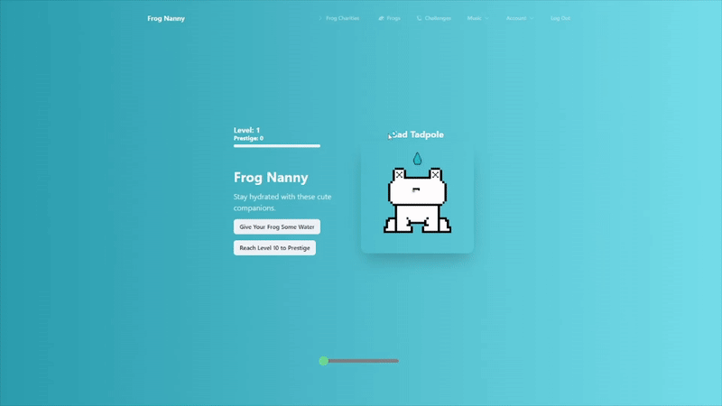
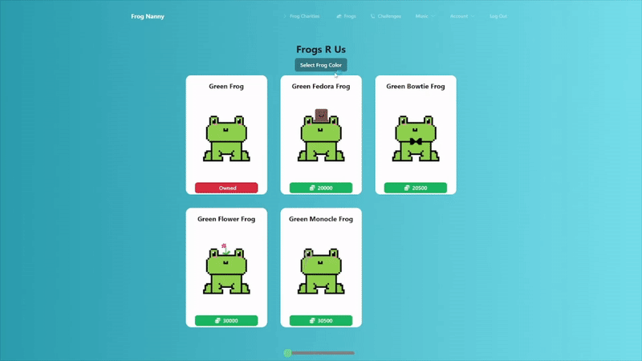
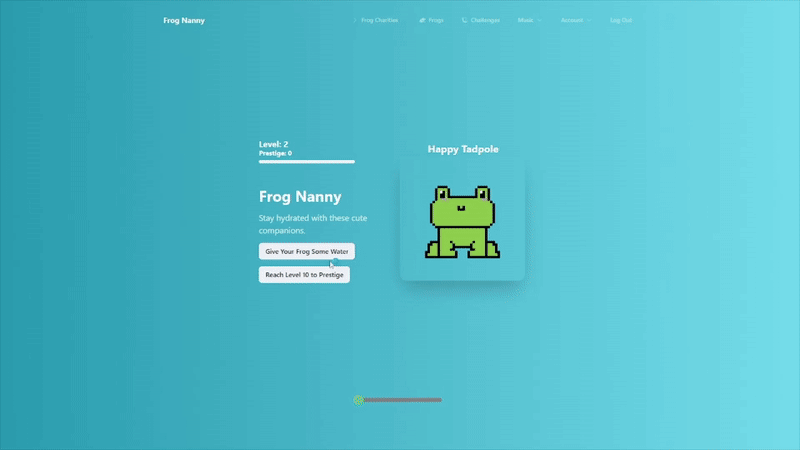

## Frog Nanny

Frog Nanny is a water-drinking progression game. The user inputs how much water they drink. Based off how much water the user drinks, they will be able to get new frogs by completing challenges. The main purpose of the app is to get the user to stay hydrated while also testing their knowledge in order to progress and get new frogs. They will be able to see their friend's frogs which allows them to socialize.

## Keep your frogs healthy!

  

## Collect Them All!

  

## Dynamic Water Container

  

## Getting started

Refer to the gettingstarted.txt file which documents all necessary steps to get this app running on your local computer.
